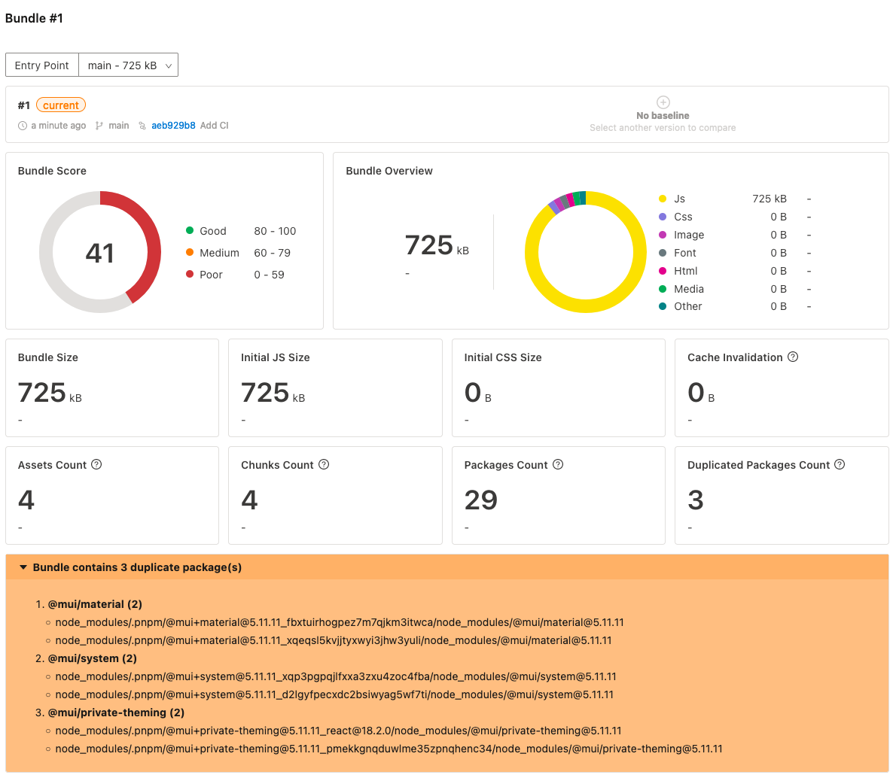

# `pnpm` duplicate packages

This is a minimal reproduction of a bug in `pnpm` where duplicate packages are installed and bundled.

`pnpm` will create different folders for a package if it contains any `peerDependencies`, it could easily lead the bundler to bundle duplicate copies of the same package.

In this repo, there is a `a` package and `b` package that both depend on `@mui/material`. But the `b` package also comes with the `@types/react` which is one of the `peerDependencies` of `@mui/material`. This will cause `pnpm` to create a different folder for `@mui/material` in `node_modules/.pnpm`.

And there is a `apps/web` package that depends on both `a` and `b`. When you run `pnpm -r build`, you will see that `@mui/material` is bundled twice in `apps/web/dist/material.js`.

## Online Bundle Report

https://perfsee.com/projects/pnpm-duplicate-packages/bundle/1

## Steps to reproduce
- clone this repo
- run `pnpm install`
- run `pnpm -r build`
